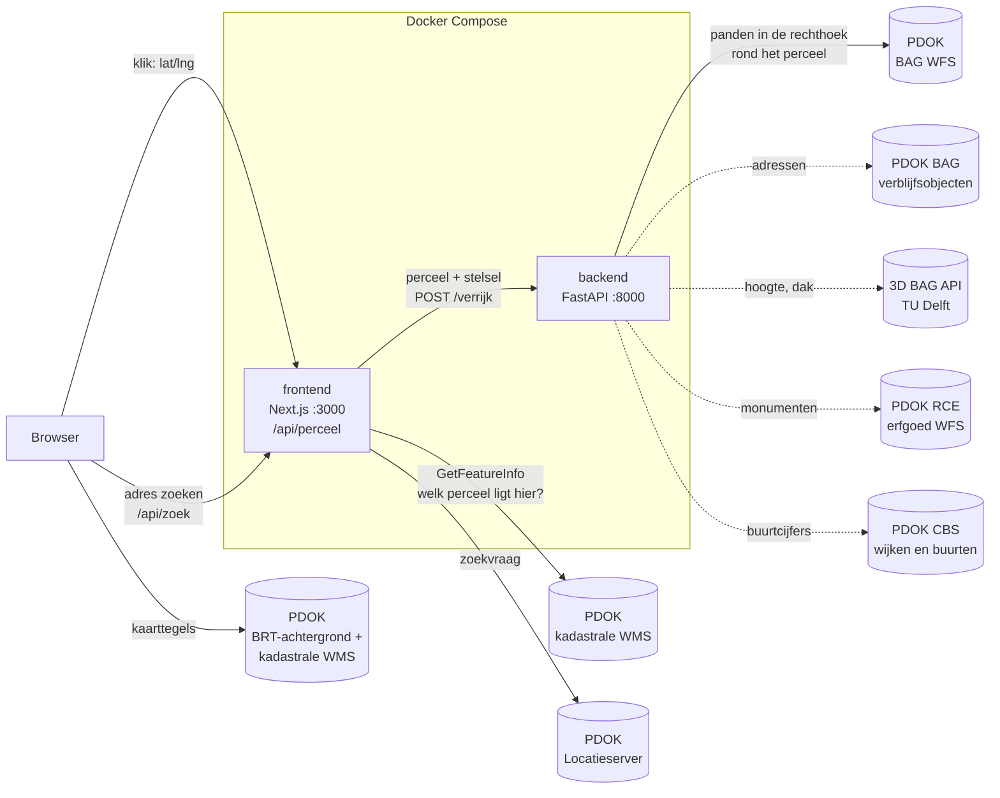

# Perceelverkenner

Zoek een adres of klik een perceel aan op de kadastrale kaart en zie wat erop staat: welke gebouwen, hoe oud en hoe hoog, welke adressen, of het beschermd erfgoed is en hoe de buurt eruitziet. Vijf open databronnen, één perceelbeeld, met per bron een vermelding of hij gelukt is.

Twee services in één repo, samen gestart met Docker Compose: een **Next.js**-frontend met een kaart en een **FastAPI**-backend die het perceel verrijkt met open data (Kadaster, BAG, 3D BAG, RCE en CBS, grotendeels via [PDOK](https://www.pdok.nl)).


## Snel starten

Nodig: Docker Desktop.

```bash
git clone https://github.com/JohnHide007/perceelverkenner.git
cd perceelverkenner
docker compose up --build
```

Open http://localhost:3000. Zoek een adres in de zoekbalk of klik op de kaart; de kaart start op de Dam in Amsterdam en het zijpaneel biedt drie voorbeelden (o.a. de Nieuwe Kerk). De kadastrale grenzen verschijnen vanaf zoomniveau 16; rechtsonder wissel je tussen kaart en luchtfoto.

De eerste build duurt een paar minuten (packages installeren). Daarna hergebruikt Docker die stap en start alles in seconden.

## Wat je te zien krijgt

Voor het aangeklikte perceel:

- **Perceel**: kadastrale aanduiding (bv. Amsterdam F 7917), berekende oppervlakte naast de officiële kadastrale grootte
- **Bebouwing**: aantal panden, bebouwd en onbebouwd oppervlak, bebouwingsgraad; panden op de kaart gekleurd op bouwjaar
- **Panden** (BAG): bouwjaar, gebruiksdoel (woon-, winkel-, kantoorfunctie, …) en hoeveel m² van elk pand op dit perceel staat
- **Adressen en gebruik** (BAG verblijfsobjecten): elk adres met gebruiksoppervlakte en gebruiksdoel, opgeteld per functie
- **Hoogte, bouwlagen en dak** (3D BAG): hoogte boven maaiveld, geschat aantal bouwlagen, daktype, m² plat en schuin dak, volume
- **Erfgoed** (RCE): rijksmonumenten op het perceel (met link naar het monumentenregister) en beschermde stads- of dorpsgezichten
- **Buurt** (CBS): gemiddelde WOZ-waarde, koop/huur, corporatiebezit, dichtheid, leegstand, energieverbruik, voorzieningen
- **Signalen**: korte, herleidbare conclusies over meerdere bronnen heen, bv. "rijksmonument: verduurzamen is vergunningplichtig" of "320 m² plat dak: indicatief ~32 kWp zon"
- **Verantwoording**: per bron of hij gelukt is en hoe lang hij deed, plus welke panden in de buurt *niet* zijn meegeteld en waarom

Een haperende bron (bv. het CBS reageert niet) haalt het antwoord niet onderuit: die bron krijgt status `fout` in de verantwoording en de rest blijft staan. Alleen de BAG-panden zijn de kern; faalt die, dan is het antwoord een `502`.

## Hoe het werkt



Doorgetrokken pijlen zijn de kern; gestippelde pijlen zijn de extra bronmodules die tegelijk draaien en los van elkaar mogen falen.

Een klik legt deze weg af:

1. De **browser** haalt de kaarttegels zelf bij PDOK: de achtergrondkaart en de kadastrale grenzen (elke tegel is een `GetMap`-verzoek).
2. De klik gaat naar de **eigen API-route** van de frontend (`/api/perceel`), niet naar de backend. De browser kent de backend niet.
3. Die route vraagt PDOK met `GetFeatureInfo` welk perceel op het klikpunt ligt en krijgt de perceelvorm terug.
4. De route stuurt het perceel door naar `http://backend:8000/verrijk`. `backend` is de servicenaam in Docker Compose en bestaat alleen binnen het Docker-netwerk.
5. De **backend** rekent het perceel om naar het Rijksdriehoekstelsel, haalt bij de BAG alle panden op in de rechthoek eromheen, snijdt ze met de echte perceelvorm en berekent de kengetallen. Tegelijk vraagt hij erfgoed en buurtcijfers op; zodra de panden bekend zijn volgen de adressen en de 3D-kenmerken van die panden (`asyncio.gather`).
6. `signalen.py` vat de bronnen samen in een paar conclusies met drempelwaarden die je gewoon in de code kunt nalezen.
7. Het antwoord gaat via de API-route terug naar de browser, die perceel en panden op de kaart tekent.

Adres zoeken loopt via dezelfde route-laag (`/api/zoek` → PDOK Locatieserver): de browser praat alleen met de frontend.

Dit heet het *backend-for-frontend*-patroon: de backend heeft in `docker-compose.yml` bewust geen poort naar buiten en is alleen via de frontend bereikbaar.

## Keuzes

### Elke bron een module, met één antwoordvorm

Elke extra bron is een eigen bestand in `backend/bronnen/` met een `haal()`-functie, een naam en een URL. De orchestratie in `main.py` roept ze aan via `veilig()`, dat de duur meet, fouten afvangt en altijd hetzelfde blok teruggeeft (`naam`, `bron`, `status`, `duur_ms`, `data`, `fout`). Een nieuwe bron toevoegen is dus: één bestand schrijven en één regel in `main.py`. Dat is ook de opzet waarmee je later een bron per land kunt wisselen zonder de rest te raken.

### Waarom deze bronnen

| Bron | Wat het toevoegt aan het perceelbeeld |
|---|---|
| BAG verblijfsobjecten | Een pand zegt *wat* er staat, een verblijfsobject *hoe het gebruikt wordt*: aantal adressen en m² gebruiksoppervlak per functie. Eén winkel of dertig appartementen is voor waarde en verhuur een wereld van verschil. |
| 3D BAG | Hoogte, bouwlagen en dakvlakken uit laseraltimetrie (AHN). Plat dak in m² is de basis voor een zon-indicatie; volume en bouwlagen zeggen iets over bruto vloeroppervlak. |
| RCE erfgoed | Een monumentstatus beperkt verbouwen en verduurzamen. Dat wil je weten vóór je over potentieel praat. |
| CBS buurtcijfers | De markt om het perceel heen: WOZ-niveau, koop/huur, corporatiebezit, leegstand, dichtheid. |

Bewust niet: energielabels (EP-Online, vereist een API-sleutel) en het omgevingsplan (Ruimtelijke plannen-API, ook met sleutel). Beide passen in dezelfde module-opzet.

### Signalen: transparant, geen model

De signalen zijn simpele regels met een drempel (`signalen.py`): onbebouwd ≥ 200 m² én ≤ 70% bebouwd → "ruimte voor uitbreiding"; bouwjaar vóór 1992 → "verduurzamingsopgave"; plat dak ≥ 50 m² → indicatief 0,1 kWp per m². Elke regel noemt zijn bron. Het is geen taxatie, wel een eerste lezing die je stap voor stap kunt controleren.

### Waarom BAG-panden als verrijking

De Basisregistratie Adressen en Gebouwen (BAG) is de officiële, landelijk dekkende bron voor gebouwen. Het vertelt wat een perceel alleen niet vertelt: *wat er staat*. Bouwjaar en gebruiksdoel zeggen iets over waarde en verduurzamingsopgave; onbebouwd oppervlak zegt iets over ontwikkelruimte.

### Alleen panden die écht op dit perceel staan

De BAG wordt bevraagd met een rechthoek rond het perceel, dus daar zitten ook buurpanden in. Elk pand wordt daarom gesneden met de werkelijke perceelvorm. Een pand telt mee als:

- minstens **5 m²** op het perceel ligt (kleinere stukjes zijn meestal kleine verschillen tussen kaarten), **en**
- minstens **10%** van het pand op het perceel ligt, **of** minstens **50 m²** (een groot pand dat over meerdere percelen loopt).

Deze drempels zijn een keuze, geen wet. Daarom toont de app ook welke kandidaten zijn afgevallen en waarom.

### Rekenen in het Rijksdriehoekstelsel

De kaart werkt in Web Mercator (EPSG:3857). Dat stelsel vervormt oppervlakte: op de breedtegraad van Amsterdam zou een perceel ongeveer 2,7× te groot uitvallen. De backend rekent daarom altijd in het Rijksdriehoekstelsel (RD, EPSG:28992), dat in meters is en voor Nederland nauwkeurig. Voor de kaart gaat de geometrie terug als lengte- en breedtegraad (WGS84).

Controle: voor de Nieuwe Kerk komt de berekening op 4.474,7 m², tegenover een kadastrale grootte van 4.366 m² (2,5% verschil: de kaartgeometrie is indicatief, de kadastrale grootte is juridisch vastgesteld).

## API (backend)

| Endpoint | Wat |
|---|---|
| `GET /health` | Leeft de service? Gebruikt door de healthcheck in Docker Compose. |
| `GET /lagen` | De lagen die de kadastrale WMS aanbiedt (uit `GetCapabilities`). |
| `POST /verrijk` | Ontvangt een perceel (GeoJSON-feature uit `GetFeatureInfo`) plus het stelsel waarin het staat, en geeft de verrijking terug: `perceel`, `bebouwing`, `panden` (met `hoogte`), `adressen`, `hoogte`, `erfgoed`, `buurt`, `signalen`, `waarschuwingen` en `bronnen` (status per bron). |

Foutafhandeling: PDOK onbereikbaar of een onverwacht antwoord geeft `502` met een duidelijke melding; een ongeldig perceel geeft `422`; klikken waar geen perceel ligt geeft `404`. Als de BAG het maximum van 1000 panden teruggeeft, staat er een waarschuwing in het antwoord en in het zijpaneel.

Interactieve documentatie: start de backend los (zie hieronder) en open http://localhost:8000/docs.

## Ontwikkelen zonder Docker

Handig voor snelle wijzigingen met automatisch herladen.

```bash
# Terminal 1: backend (Python 3.12)
cd backend
pip install -r requirements-dev.txt
uvicorn main:app --reload --port 8000

# Terminal 2: frontend (Node 24)
cd frontend
npm install
npm run dev
```

De frontend leest `BACKEND_URL` (standaard `http://localhost:8000`, zie `frontend/.env.example`). In Docker Compose is dat `http://backend:8000`.

Backend los testen met het voorbeeldperceel:

```bash
curl -X POST http://localhost:8000/verrijk \
  -H "Content-Type: application/json" \
  -d @backend/voorbeelden/dam_perceel.json
```

## Tests

```bash
cd backend
pip install -r requirements-dev.txt
pytest -v
```

51 tests, zonder netwerk: `tests/conftest.py` geeft elke `httpx.AsyncClient` een nep-transport, zodat geen enkele test per ongeluk het internet op gaat.

- `test_verrijking.py`: coördinatenstelsels, reparatie van ongeldige vormen, welke panden wel en niet meetellen, en de Nieuwe Kerk tegen de kadastrale grootte
- `test_bronnen.py`: elke bronmodule los (filteren op de juiste panden, NAP-hoogte naar hoogte boven maaiveld, afgeschermde CBS-waarden, monumentpunt binnen de marge), de vaste antwoordvorm van `veilig()` en de signalen
- `test_api.py`: de endpoints, inclusief een perceel in Web Mercator dat op dezelfde m² moet uitkomen, en de volledige antwoordvorm
- `test_pdok.py`: gedrag als PDOK iets onverwachts teruggeeft of niet bereikbaar is, en dat een haperende extra bron het antwoord niet breekt

Bij elke pull request draait GitHub Actions (`.github/workflows/ci.yml`): de backend-tests, lint + typecheck + build van de frontend, en een check op `docker-compose.yml`. Op `main` kan alleen via een pull request worden gemerged.

## Projectstructuur

```
perceelverkenner/
├── docker-compose.yml          beide services, netwerk en healthcheck
├── backend/
│   ├── main.py                 endpoints en de orchestratie van de bronnen
│   ├── verrijking.py           geo-logica: omrekenen, snijden, kengetallen (geen netwerk)
│   ├── signalen.py             meerdere bronnen → korte conclusies (geen netwerk)
│   ├── bronnen/                één module per bron, zelfde antwoordvorm
│   │   ├── __init__.py         veilig(): duur meten, fouten afvangen, vaste vorm
│   │   ├── adressen.py         BAG verblijfsobjecten
│   │   ├── hoogte.py           3D BAG (hoogte, bouwlagen, dak)
│   │   ├── erfgoed.py          RCE rijksmonumenten en beschermde gezichten
│   │   └── buurt.py            CBS kerncijfers wijken en buurten
│   ├── voorbeelden/            voorbeeldperceel (Nieuwe Kerk, Amsterdam)
│   ├── tests/
│   └── Dockerfile
├── frontend/
│   ├── app/api/perceel/route.ts   API-route: klik → PDOK → backend
│   ├── app/api/zoek/route.ts      API-route: adres zoeken via de Locatieserver
│   ├── components/Kaart.tsx       Leaflet-kaart: PDOK-lagen, luchtfoto, bouwjaarlegenda
│   ├── components/Zijpaneel.tsx   kengetallen, signalen en secties per bron
│   ├── components/Zoekbalk.tsx    adres zoeken met suggesties
│   ├── components/ui.tsx          kleine bouwstenen (kengetal, sectie, chip, skelet)
│   ├── lib/types.ts, lib/format.ts
│   ├── app/page.tsx
│   └── Dockerfile              multi-stage build, draait als niet-root gebruiker
└── .github/workflows/ci.yml
```

## Wat nog beter kan

- De drempels (buren-filter én signalen) onderbouwen met een steekproef, of relatief maken ten opzichte van de perceelgrootte
- Energielabels (EP-Online) en het omgevingsplan als extra modules; beide vragen een API-sleutel
- Antwoorden cachen (bv. Redis) en een retry-beleid richting PDOK; de 3D BAG is nu één verzoek per pand (max. 12)
- Bij heel grote percelen de BAG-resultaten pagineren in plaats van waarschuwen
- Een AI-laag die de `/verrijk`-JSON als tool gebruikt en een conclusie met bronnen schrijft

## Databronnen

Alle data is open data, bijna alles via [PDOK](https://www.pdok.nl):

| Bron | Service | Gebruikt voor |
|---|---|---|
| Kadastrale kaart (Kadaster) | WMS `service.pdok.nl/kadaster/kadastralekaart/wms/v5_0`, laag `Perceelvlak` | perceelgrenzen op de kaart en het aangeklikte perceel |
| BAG (Kadaster) | WFS `service.pdok.nl/lv/bag/wfs/v2_0`, lagen `bag:pand` en `bag:verblijfsobject` | de panden en hun kenmerken; de adressen met gebruiksoppervlak en -doel |
| 3D BAG (TU Delft) | API `api.3dbag.nl/collections/pand/items/{id}` | hoogte, bouwlagen, daktype, dakvlakken, volume (niet via PDOK; CC BY 4.0) |
| Erfgoed (RCE) | WFS `service.pdok.nl/rce/ps-ch/wfs/v1_0`, lagen `rce_inspire_points` en `_polygons` | rijksmonumenten, beschermde stads- en dorpsgezichten, werelderfgoed |
| Wijken en buurten (CBS) | WFS `service.pdok.nl/cbs/wijkenbuurten/2024/wfs/v1_0`, laag `buurten` | kerncijfers van de buurt waarin het perceel ligt |
| Locatieserver (Kadaster) | `api.pdok.nl/bzk/locatieserver/search/v3_1/free` | adres zoeken |
| BRT-achtergrondkaart | WMTS `service.pdok.nl/brt/achtergrondkaart/wmts/v2_0`, grijs | de ondergrond |
| Luchtfoto (Beeldmateriaal) | WMTS `service.pdok.nl/hwh/luchtfotorgb/wmts/v1_0`, `Actueel_orthoHR` | de ondergrond, als je die inschakelt |
