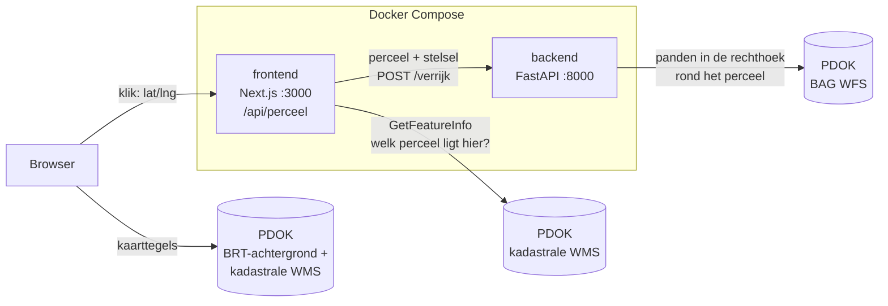

# Perceelverkenner

Klik een perceel aan op de kadastrale kaart en zie wat erop staat: welke gebouwen, hoe oud, waarvoor gebruikt en hoeveel van het perceel bebouwd is.

Twee services in één repo, samen gestart met Docker Compose: een **Next.js**-frontend met een kaart en een **FastAPI**-backend die het perceel verrijkt met open data van het Kadaster via [PDOK](https://www.pdok.nl).


## Snel starten

Nodig: Docker Desktop.

```bash
git clone https://github.com/JohnHide007/perceelverkenner.git
cd perceelverkenner
docker compose up --build
```

Open http://localhost:3000. De kaart start op de Dam in Amsterdam; klik bijvoorbeeld op de Nieuwe Kerk. De kadastrale grenzen verschijnen vanaf zoomniveau 16.

De eerste build duurt een paar minuten (packages installeren). Daarna hergebruikt Docker die stap en start alles in seconden.

## Wat je te zien krijgt

Voor het aangeklikte perceel:

- **Perceel**: kadastrale aanduiding (bv. Amsterdam F 7917), berekende oppervlakte naast de officiële kadastrale grootte
- **Bebouwing**: aantal panden, bebouwd en onbebouwd oppervlak, bebouwingsgraad
- **Panden**: bouwjaar, gebruiksdoel (woon-, winkel-, kantoorfunctie, …) en hoeveel m² van elk pand op dit perceel staat
- **Verantwoording**: welke panden in de buurt zijn *niet* meegeteld, en waarom

## Hoe het werkt



Een klik legt deze weg af:

1. De **browser** haalt de kaarttegels zelf bij PDOK: de achtergrondkaart en de kadastrale grenzen (elke tegel is een `GetMap`-verzoek).
2. De klik gaat naar de **eigen API-route** van de frontend (`/api/perceel`), niet naar de backend. De browser kent de backend niet.
3. Die route vraagt PDOK met `GetFeatureInfo` welk perceel op het klikpunt ligt en krijgt de perceelvorm terug.
4. De route stuurt het perceel door naar `http://backend:8000/verrijk`. `backend` is de servicenaam in Docker Compose en bestaat alleen binnen het Docker-netwerk.
5. De **backend** rekent het perceel om naar het Rijksdriehoekstelsel, haalt bij de BAG alle panden op in de rechthoek eromheen, snijdt ze met de echte perceelvorm en berekent de kengetallen.
6. Het antwoord gaat via de API-route terug naar de browser, die perceel en panden op de kaart tekent.

Dit heet het *backend-for-frontend*-patroon: de backend heeft in `docker-compose.yml` bewust geen poort naar buiten en is alleen via de frontend bereikbaar.

## Keuzes

### Waarom BAG-panden als verrijking

De Basisregistratie Adressen en Gebouwen (BAG) is de officiële, landelijk dekkende bron voor gebouwen. Het vertelt wat een perceel alleen niet vertelt: *wat er staat*. Bouwjaar en gebruiksdoel zeggen iets over waarde en verduurzamingsopgave; onbebouwd oppervlak zegt iets over ontwikkelruimte.

### Alleen panden die écht op dit perceel staan

De BAG wordt bevraagd met een rechthoek rond het perceel, dus daar zitten ook buurpanden in. Elk pand wordt daarom gesneden met de werkelijke perceelvorm. Een pand telt mee als:

- minstens **5 m²** op het perceel ligt (kleinere stukjes zijn meestal kleine verschillen tussen kaarten), **en**
- minstens **10%** van het pand op het perceel ligt, **of** minstens **50 m²** (een groot pand dat over meerdere percelen loopt).

Deze drempels zijn een keuze, geen wet. Daarom toont de app ook welke kandidaten zijn afgevallen en waarom.

### Rekenen in het Rijksdriehoekstelsel

De kaart werkt in Web Mercator (EPSG:3857). Dat stelsel vervormt oppervlakte: op de breedtegraad van Amsterdam zou een perceel ongeveer 2,7× te groot uitvallen. De backend rekent daarom altijd in het Rijksdriehoekstelsel (RD, EPSG:28992), dat in meters is en voor Nederland nauwkeurig. Voor de kaart gaat de geometrie terug als lengte- en breedtegraad (WGS84).

Controle: voor de Nieuwe Kerk komt de berekening op 4.474,7 m², tegenover een kadastrale grootte van 4.366 m² (2,5% verschil: de kaartgeometrie is indicatief, de kadastrale grootte is juridisch vastgesteld).

## API (backend)

| Endpoint | Wat |
|---|---|
| `GET /health` | Leeft de service? Gebruikt door de healthcheck in Docker Compose. |
| `GET /lagen` | De lagen die de kadastrale WMS aanbiedt (uit `GetCapabilities`). |
| `POST /verrijk` | Ontvangt een perceel (GeoJSON-feature uit `GetFeatureInfo`) plus het stelsel waarin het staat, en geeft de verrijking terug. |

Foutafhandeling: PDOK onbereikbaar of een onverwacht antwoord geeft `502` met een duidelijke melding; een ongeldig perceel geeft `422`; klikken waar geen perceel ligt geeft `404`. Als de BAG het maximum van 1000 panden teruggeeft, staat er een waarschuwing in het antwoord en in het zijpaneel.

Interactieve documentatie: start de backend los (zie hieronder) en open http://localhost:8000/docs.

## Ontwikkelen zonder Docker

Handig voor snelle wijzigingen met automatisch herladen.

```bash
# Terminal 1: backend (Python 3.12)
cd backend
pip install -r requirements-dev.txt
uvicorn main:app --reload --port 8000

# Terminal 2: frontend (Node 24)
cd frontend
npm install
npm run dev
```

De frontend leest `BACKEND_URL` (standaard `http://localhost:8000`, zie `frontend/.env.example`). In Docker Compose is dat `http://backend:8000`.

Backend los testen met het voorbeeldperceel:

```bash
curl -X POST http://localhost:8000/verrijk \
  -H "Content-Type: application/json" \
  -d @backend/voorbeelden/dam_perceel.json
```

## Tests

```bash
cd backend
pip install -r requirements-dev.txt
pytest -v
```

29 tests, zonder netwerk: PDOK wordt in de tests nagebootst.

- `test_verrijking.py`: coördinatenstelsels, reparatie van ongeldige vormen, welke panden wel en niet meetellen, en de Nieuwe Kerk tegen de kadastrale grootte
- `test_api.py`: de endpoints, inclusief een perceel in Web Mercator dat op dezelfde m² moet uitkomen
- `test_pdok.py`: gedrag als PDOK iets onverwachts teruggeeft of niet bereikbaar is

Bij elke pull request draait GitHub Actions (`.github/workflows/ci.yml`): de backend-tests, lint + typecheck + build van de frontend, en een check op `docker-compose.yml`. Op `main` kan alleen via een pull request worden gemerged.

## Projectstructuur

```
perceelverkenner/
├── docker-compose.yml          beide services, netwerk en healthcheck
├── backend/
│   ├── main.py                 endpoints en de aanroepen naar PDOK
│   ├── verrijking.py           geo-logica: omrekenen, snijden, kengetallen (geen netwerk)
│   ├── voorbeelden/            voorbeeldperceel (Nieuwe Kerk, Amsterdam)
│   ├── tests/
│   └── Dockerfile
├── frontend/
│   ├── app/api/perceel/route.ts   API-route: klik → PDOK → backend
│   ├── components/Kaart.tsx       Leaflet-kaart met PDOK-lagen
│   ├── components/Zijpaneel.tsx   resultaat naast de kaart
│   ├── app/page.tsx
│   └── Dockerfile              multi-stage build, draait als niet-root gebruiker
└── .github/workflows/ci.yml
```

## Wat nog beter kan

- De drempels onderbouwen met een steekproef, of relatief maken ten opzichte van de perceelgrootte
- Meer bronnen combineren tot één conclusie: energielabels (EP-Online) per pand, bestemmingsplan
- Elke bron als eigen module met een vaste antwoordvorm en bronvermelding
- Antwoorden cachen (bv. Redis) en een retry-beleid richting PDOK
- Bij heel grote percelen de BAG-resultaten pagineren in plaats van waarschuwen

## Databronnen

Alle data komt als open data van het Kadaster via [PDOK](https://www.pdok.nl):

| Bron | Service | Gebruikt voor |
|---|---|---|
| Kadastrale kaart | WMS `service.pdok.nl/kadaster/kadastralekaart/wms/v5_0`, laag `Perceelvlak` | perceelgrenzen op de kaart en het aangeklikte perceel |
| BAG | WFS `service.pdok.nl/lv/bag/wfs/v2_0`, laag `bag:pand` | de panden en hun kenmerken |
| BRT-achtergrondkaart | WMTS `service.pdok.nl/brt/achtergrondkaart/wmts/v2_0`, grijs | de ondergrond |
